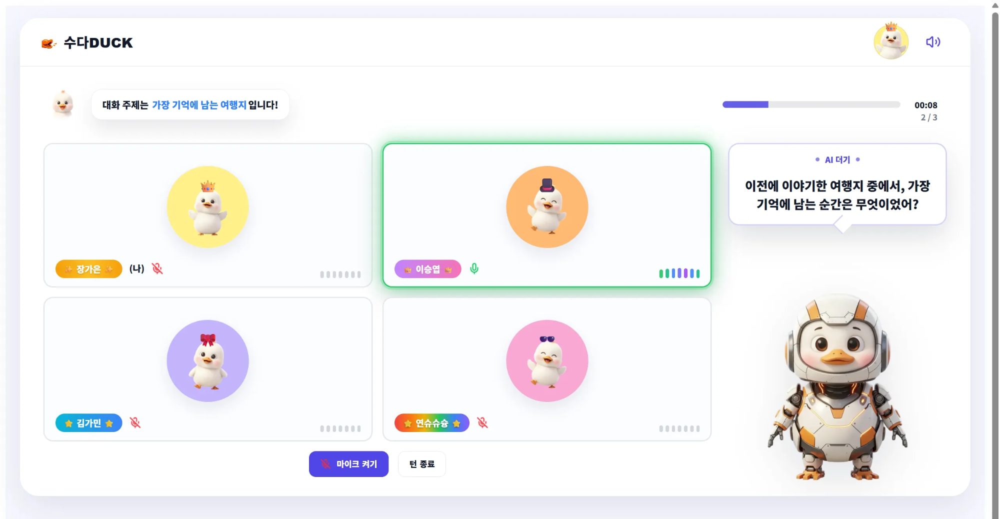
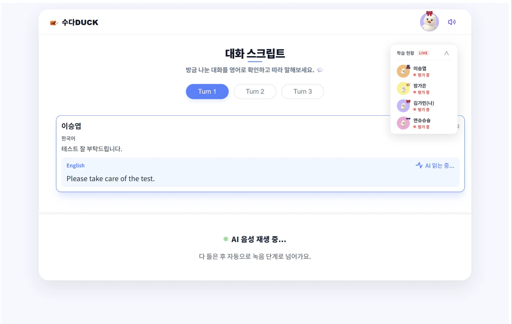
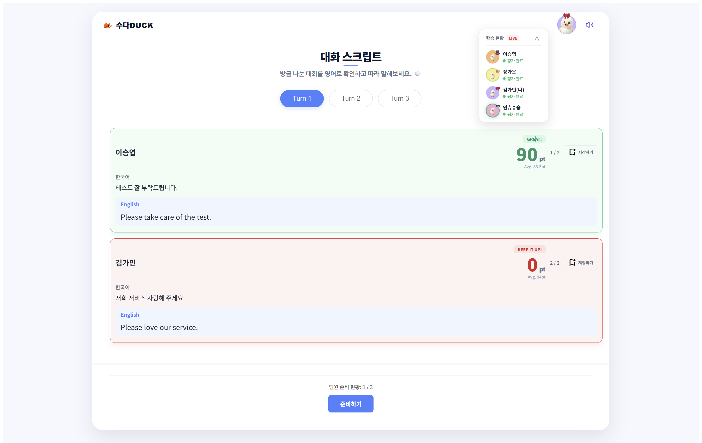
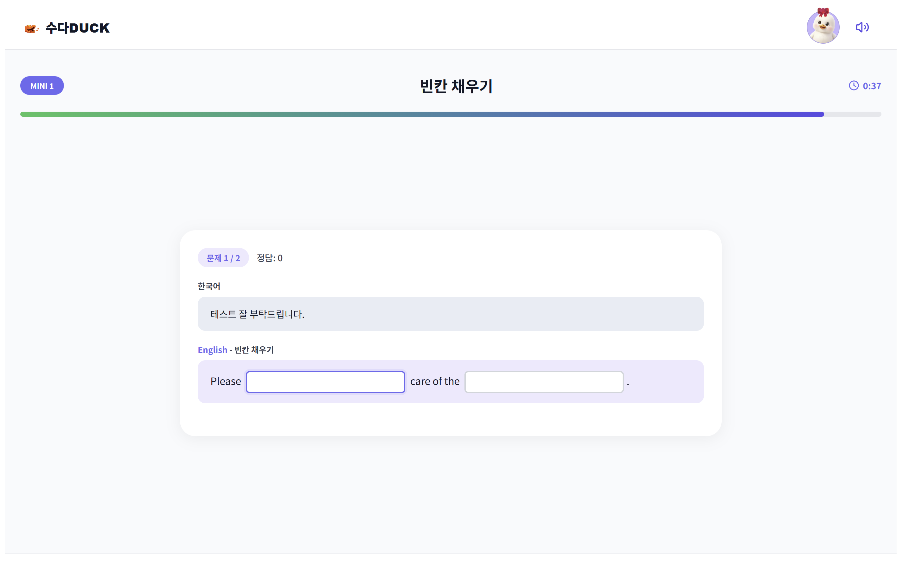
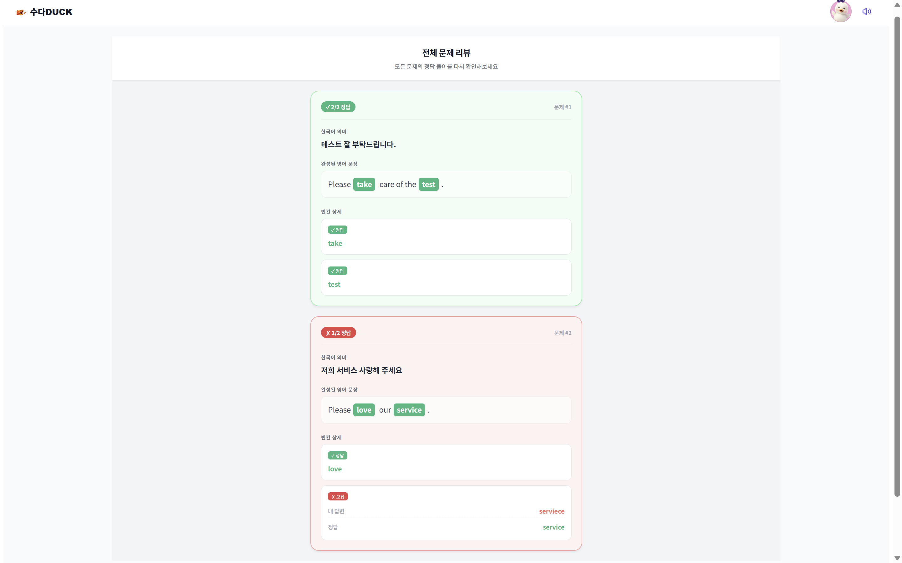
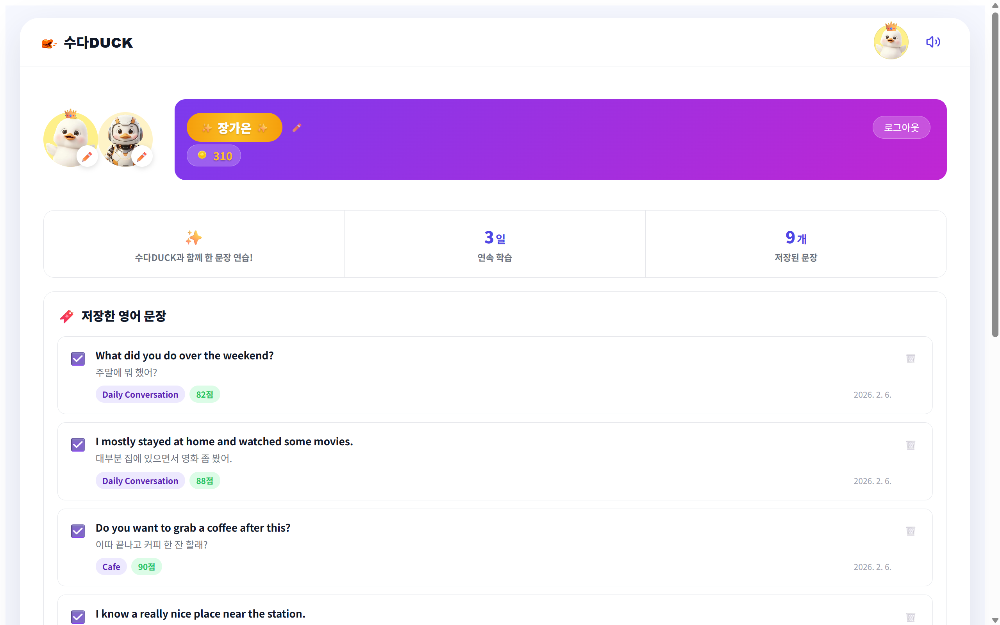
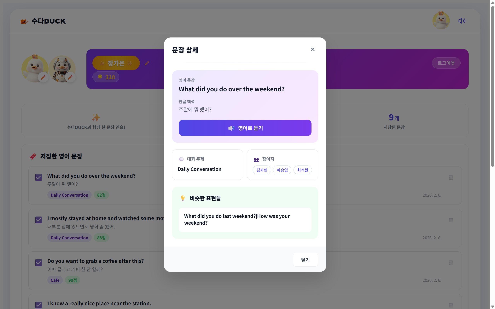
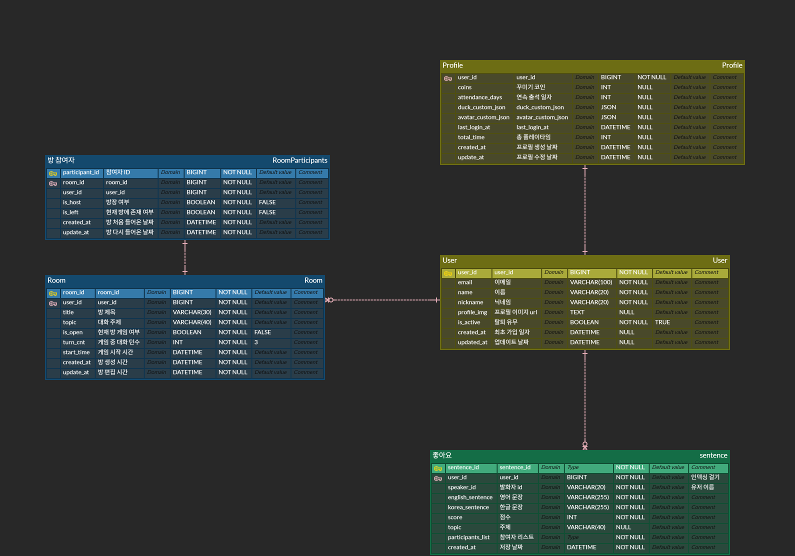
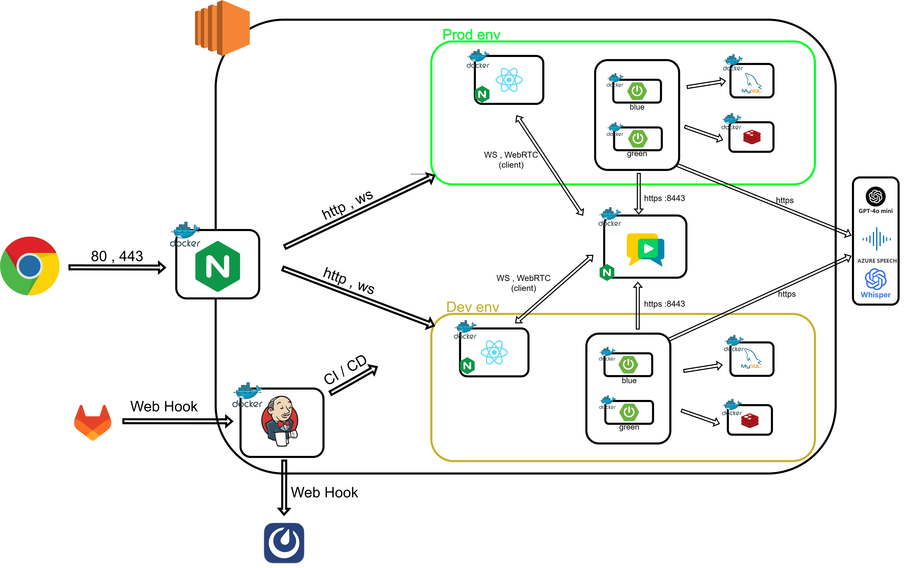

# 🦆 수다DUCK (SudaDUCK)

### **"친구들과 수다 떨듯 가볍게 배우는 AI 실시간 영어 회화"**

지루한 공부는 이제 그만! AI와 친구들이 함께 어울리는 실시간 상호작용 학습 플랫폼입니다.

---

## 📌 프로젝트 소개

현대인들에게 영어 공부는 늘 숙제 같고 지루한 영역입니다. **수다DUCK**은 이러한 심리적 장벽을 허물기 위해 탄생했습니다.

- **심리적 장벽 완화:** AI 피드백을 통해 실수에 대한 두려움 없이 말할 수 있습니다.
- **실전 중심 소통:** 텍스트 위주의 학습에서 벗어나 STT/TTS 기반의 실시간 음성 대화를 지향합니다.
- **재미있는 복습:** 게이미피케이션 요소를 도입하여 학습이 아닌 '놀이'처럼 영어를 익힙니다.

---

## ✨ 주요 기능 (Key Features)

<table width="100%"> <tr> <td width="50%" align="center"><b>1. 한국어로 함께 대화하기</b></td> <td width="50%" align="center"><b>2. AI 영어 스크립트 & 발화 평가</b></td> </tr> <tr> <td align="center"> 

▼

  
한국어 음성을 STT를 통해 실시간으로 인식하여

자연스러운 영어로 변환해 줍니다. </td> <td align="center"> 

▼

  
대화 맥락을 분석해 최적의 스크립트를 제공하고

사용자의 발음을 정밀하게 평가합니다. </td> </tr> </table>

<table width="100%"> <tr> <td width="50%" align="center"><b>3. 복습 게임</b></td> <td width="50%" align="center"><b>4. 마이페이지</b></td> </tr> <tr> <td align="center"> 

▼

  
세션 종료 후 나눈 대화 내용을 바탕으로

빈칸 맞추기 등 복습 게임을 즐깁수 있습니다. </td> <td align="center"> 

▼

  
캐릭터를 꾸미고 플레이 중 저장한

나만의 스크립트를 언제든 다시 열람 가능합니다. </td> </tr> </table>

---

## 🛠 기술 스택 (Tech Stack)

### 💻 Development

- **Frontend**: `React`, `WebSocket (STOMP)`
  - 컴포넌트 기반 아키텍처를 통한 UI 재사용성 확보 및 실시간 양방향 통신 구현.
- **Backend**: `Java`, `Spring Boot`, `Spring Data JPA`, `Spring Security`
  - 강력한 생태계와 안정성을 바탕으로 비즈니스 로직 및 보안 체계 구축.
- **Database**: `MySQL 8.0`, `Redis`
  - **MySQL**: 사용자 정보 및 대화 로그 등 영구 데이터 관리.
  - **Redis**: 세션 관리, 실시간 턴 관리 및 타이머(정적 감지) 데이터 캐싱.
- **Real-time Communication**: `OpenVidu (v2)`, `WebRTC (SFU)`, `WebSocket (STOMP)`
  - **SFU(Selective Forwarding Unit)** 아키텍처를 채택하여 서버 부하를 최적화하고, 다대다 대화 환경에서 안정적인 미디어 스트리밍 구현.

### 🤖 AI Integration

- **LLM**: `GPT-4o mini`
  - 문법 교정, STT 전처리, 비속어 필터링, 학습 스크립트 생성, 대화 가이드 생성 및 퀴즈 생성 로직 담당
- **Voice**: `Azure Speech (TTS, pronunciation)`, `Whisper API (STT)`
  - 고성능 음성 인식 및 자연스러운 가이드 음성 합성. 발음평가

### 🚀 DevOps & Infrastructure

- **Cloud**: `AWS EC2`
  - 서비스 호스팅 및 정적 리소스(이미지, 음성 파일) 저장.
- **Container**: `Docker`, `Docker Compose`
  - 개발 환경과 운영 환경의 일치 및 배포 용이성 확보.
- **CI/CD**: `Jenkins`, `GitLab Webhook`
  - 코드 푸시 시 자동 빌드 및 배포 파이프라인 구축.
- **Proxy/Web**: `Nginx`
  - HTTPS 보안 적용 및 블루/그린 무중단 배포를 위한 트래픽 라우팅.

---

## 🧪 핵심 알고리즘 & 로직

### 1️⃣ 동시 입력 처리 파이프라인

다수의 사용자가 실시간으로 대화할 때 발생하는 데이터 혼선과 지연을 방지하기 위한 구조입니다

1. **Redis INCR Sequence:** 데이터 처리 순서를 보장하기 위해 고유 번호를 발급합니다
2. **3단계 전처리**
   - **Noise Filter:** 특수문자 및 불필요한 반복 단어 제거
   - **Semantic Check:** 무의미한 입력을 걸러내어 AI API 호출 비용 절감
   - **Safety Filter:** 부적절한 표현 차단
3. **LLM & TTS:** GPT-4o mini로 스크립트를 생성하고 Azure TTS를 통해 가이드 음성을 출력합니다

### 2️⃣ 정적 감지 (Silence Detection)

대화 흐름이 끊기지 않도록 10초 침묵 시 AI가 개입합니다

- 유저의 발화 시간을 체크하기 위해 `TaskScheduler`를 사용하여 로직 간소화
- 실시간 동시 처리 환경에서 방마다 스케줄러를 관리하기 위해 **`ConcurrentHashMap` 를 사용하여 멀티스레드 환경에서 안정화**

---

## 🔗 Project Documents

수다DUCK의 상세 기획 및 설계 내용은 아래 문서에서 확인하실 수 있습니다.

- [🛠 포팅 매뉴얼](./exec/포팅메뉴얼.md)
- [📑 요구사항 명세서](https://www.notion.so/2e8826715e6280ce8f26cea5c674f82a?pvs=21)
- [📑 API 명세서](https://www.notion.so/API-2ea826715e628000bcfadb7d9bd88d41?pvs=21)

---

### 📔 Data Modeling

---

## 🏗 시스템 아키텍처

확장성과 안정성을 고려한 **Docker 기반 무중단 배포** 환경을 구축하였습니다.

- **Infrastructure:** AWS EC2 , Nginx (Reverse Proxy)
- **CI/CD:** GitLab Webhook + Jenkins 연동 및 **Blue/Green 무중단 배포** 적용
- **AI Integration:** GPT-4o mini, Azure Speech, Whisper API를 활용한 고도화된 처리

---

## 👥 팀원 소개

<table>

<tr>

<td align="center">김가민 - <b>팀장 / BE</b></td>

<td align="center">장가은 - <b>BE</b></td>

<td align="center">이승엽 - <b>Infra</b></td>

</tr>

<tr>

<td>프로젝트 총괄 
전반적인 백엔드 API 개발 
SpringSecurity & OAuth  
Redis 설계  
DB 최적화</td>

<td>
  전반적인 백엔드 API 개발 
  대기방·게임방 상태 관리 로직 설계 
  OpenVidu 기반 WebRTC 연동 및 실시간 통신 처리 
  WebSocket(STOMP) 기반 방 상태·준비 상태 동기화 
  Redis 캐싱 적용
</td>

<td>
  Docker 기반 Dev/Prod 환경 격리 및 가상 네트워크 설계 
  Jenkins Pipeline을 활용한 CI/CD 
  Blue-Green 무중단 배포 구현 
  Mattermost Webhook 기반 실시간 배포 알림 자동화
</td>

<tr>

<td align="center">전연수 - <b>FE</b></td>

<td align="center">최석원 - <b>FE</b></td>

<td align="center">최현웅 - <b>AI</b></td>

</tr>

<td>UI/UX 설계 및 React 기반 화면 구현 
WebSocket 연동을 통한 실시간 UI 처리 
음성 녹음 기능 구현 및 사용자 흐름 제어 
API 연동 및 프론트엔드 상태 관리</td>

<td>WebSocket 연동

실시간 UI 반응형 구현</td>

<td>프롬프트 엔지니어링

STT/TTS 파이프라인 최적화</td>

</tr>

</table>
