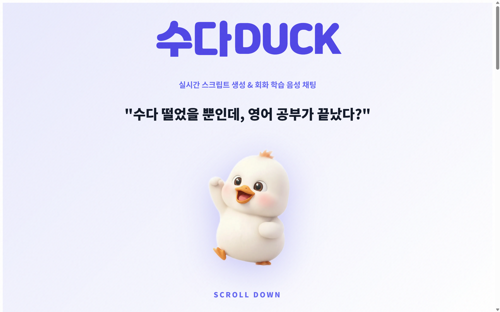
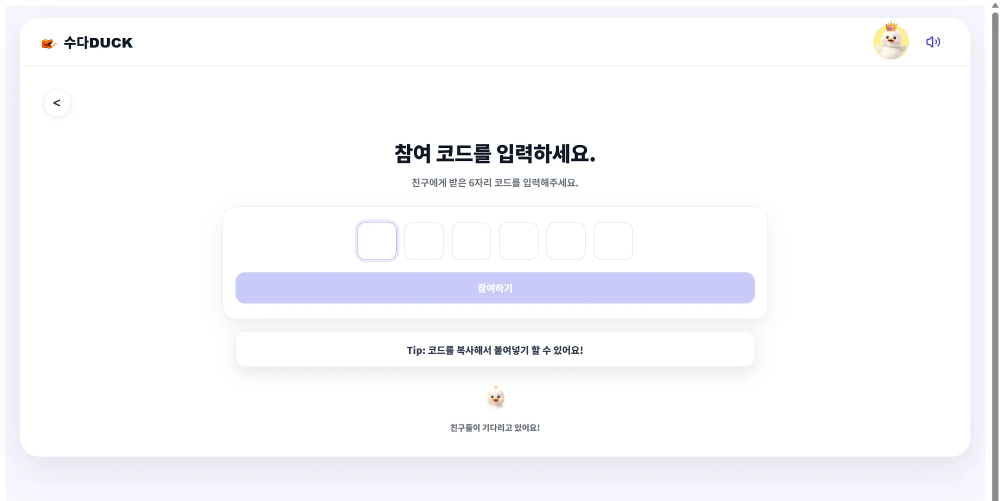
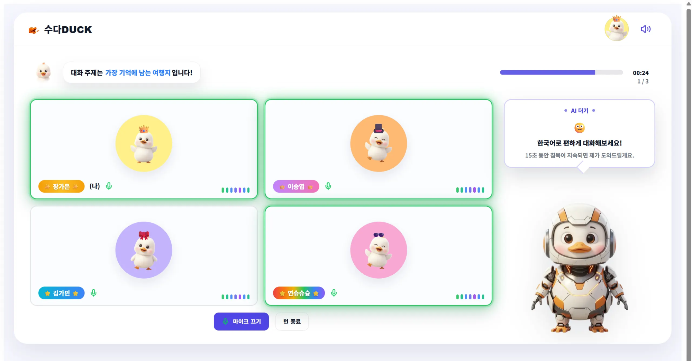
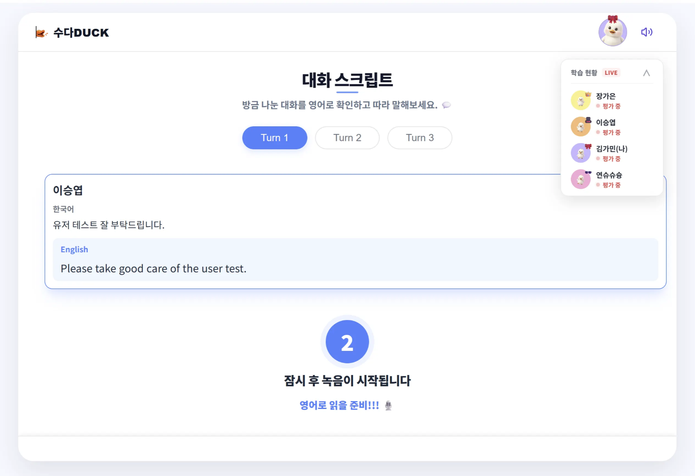

# [수다DUCK] 포팅 매뉴얼

## 1. 개발 환경

### 1.1. Front-End (React)

- **Runtime:** Node.js `v24.12.0`
- **Framework:** React `19.2.0`
- **Build Tool:** Vite `7.2.4`
- **Language:** TypeScript / JavaScript
- **Communication & Media:**
    - `openvidu-browser`: `2.25.0` (WebRTC)
    - `axios`: `1.13.4` (HTTP Client)
    - `@stomp/stompjs`: `7.2.1` (WebSocket)
    - `sockjs-client`: `1.6.1` (WebSocket Fallback)
- **Routing:** `react-router-dom`: `7.12.0`
- **Styling:** `tailwindcss`: `4.1.18`
- **Proxy Configuration:** `vite.config.ts` (Dev API, WebSocket, Audio Proxy 설정 포함)

### 1.2. Back-End (Spring Boot)

- **Framework:** Spring Boot `3.5.9`
- **Language:** Java JDK `17` (Docker Image: `eclipse-temurin:17-jdk-alpine`)
- **Build Tool:** Gradle `8.14.3`
- **Plugin:** Dependency Management `1.1.7`
- **Core Dependencies:**
    - `spring-boot-starter-web`
    - `spring-boot-starter-data-jpa`
    - `spring-boot-starter-data-redis`
    - `spring-boot-starter-security`
    - `spring-boot-starter-oauth2-client`
- **External Services & Libraries:**
    - `openvidu-java-client`: `2.25.0` (WebRTC Signaling)
    - `ms-cognitive-services-speech`: `1.47.0` (Azure STT/TTS)
    - `jjwt`: `0.12.3` (JWT Authentication)
    - `springdoc-openapi`: `2.3.0` (Swagger UI)

### 1.3. Infrastructure & DevOps

- **Operating System:** Ubuntu `20.04 LTS` (AWS EC2)
- **Container Runtime:** Docker Engine / Docker Compose `v3.8` (App), `v3.1` (OpenVidu)
- **Database:**
    - MySQL: `8.0.43` (Dev/Prod 컨테이너 분리)
    - Redis: `Alpine` (Dev/Prod 컨테이너 분리)
- **Web Server / Gateway:** Nginx `Latest` (Docker Image)
- **Media Server:** OpenVidu Server `2.25.0` (Host Network Mode)
- **CI/CD:** Jenkins `LTS` (Docker-in-Docker 구성)
- **Container Management:** Portainer `CE Latest`

## 2. 아키텍쳐 구성도


## 3. 인프라 구축

### 3.1. 네트워크 구성 (Docker Network)

서비스 간의 격리 및 보안을 위해 용도별로 3개의 Docker 네트워크를 생성하여 운영합니다.

- **app-network**: Jenkins, Portainer 등 관리 도구 전용 네트워크.
- **dev-net**: 개발(Dev) 환경의 DB, Backend, Frontend가 통신하는 망.
- **prod-net**: 운영(Prod) 환경의 DB, Backend, Frontend가 통신하는 망.

```bash
docker network create app-network
docker network create dev-net
docker network create prod-net
```

### 3.2. 전체 서버 포트 점유 현황

본 프로젝트에서 사용하는 모든 포트와 프로토콜은 다음과 같습니다. AWS Security Group 설정 시 참고하십시오.

| **서비스명** | **Host Port** | **Protocol** | **설정 출처** |
| --- | --- | --- | --- |
| **Main Nginx** | **80, 443** | TCP | `docker-compose.yml` |
| **OpenVidu Nginx** | **8443** | TCP | `.env` (`HTTPS_PORT`) |
| **OpenVidu Nginx** | **8442** | TCP | `.env` (`HTTP_PORT`) |
| **Coturn** | **8478** | TCP/UDP | `command` (`--listening-port`) |
| **Coturn** | **8500 - 8850** | TCP/UDP | `command` (`--min/max-port`) |
| **KMS** | **8100 - 8200** | TCP/UDP | `environment` (`KMS_MIN/MAX`) |
| **OpenVidu** | **5443** | TCP | `docker-compose.yml` (Internal) |
| **Jenkins** | **8333** | TCP | `docker-compose.yml` |
| **Portainer** | **8000** | TCP | `docker-compose.yml` |
| **Prod Backend** | **8083, 8084** | TCP | `Jenkins Pipeline` (Blue/Green) |
| **Dev Backend** | **8081, 8082** | TCP | `Jenkins Pipeline` (Blue/Green) |
| **Prod Frontend** | **3001** | TCP | `Jenkins Pipeline` |
| **Dev Frontend** | **3000** | TCP | `Jenkins Pipeline` |

### 3.3. 데이터베이스 구축 (DB & Redis)

개발(Dev) 데이터와 운영(Prod) 데이터의 물리적 오염을 방지하기 위해 컨테이너를 분리하여 구동합니다.

**📂 `docker-compose.db.yml`**

```yaml
version: '3.8'

services:
  # [PROD] 운영 환경 (prod-net)
  prod-db:
    image: mysql:8.0.43
    container_name: prod-db
    environment:
      MYSQL_ROOT_PASSWORD: ${DB_ROOT_PASSWORD}
      MYSQL_DATABASE: prod_db
    volumes:
      - ./data/prod/mysql:/var/lib/mysql
    networks:
      - prod-net

  prod-redis:
    image: redis:alpine
    container_name: prod-redis
    networks:
      - prod-net

  # [DEV] 개발 환경 (dev-net)
  dev-db:
    image: mysql:8.0.43
    container_name: dev-db
    environment:
      MYSQL_ROOT_PASSWORD: ${DB_ROOT_PASSWORD}
      MYSQL_DATABASE: dev_db
    volumes:
      - ./data/dev/mysql:/var/lib/mysql
    networks:
      - dev-net

  dev-redis:
    image: redis:alpine
    container_name: dev-redis
    networks:
      - dev-net

networks:
  prod-net:
    external: true
  dev-net:
    external: true
```

### 3.4. Main Gateway (Nginx) & 관리 도구

외부 트래픽의 진입점(Gateway) 역할을 수행하며, Jenkins가 배포 시점에 설정을 변경할 수 있도록 볼륨 권한을 조정합니다.

**📂 `docker-compose.yml` (Main)**

```yaml
version: '3.8'

services:
  main-nginx:
    image: nginx:latest
    container_name: main-nginx
    restart: always
    ports:
      - "80:80"
      - "443:443"
    volumes:
      - ./nginx.conf:/etc/nginx/nginx.conf
      - /etc/letsencrypt:/etc/letsencrypt
      - ./conf.d:/etc/nginx/conf.d  # [중요] Jenkins가 service-url 파일을 수정해야 함
    extra_hosts:
      - "host.docker.internal:host-gateway"
    networks:
      - app-network
      - dev-net
      - prod-net

  jenkins:
    image: jenkins/jenkins:lts
    container_name: jenkins
    restart: always
    ports:
      - "8333:8080"
    volumes:
      - ./jenkins_home:/var/jenkins_home
      - /var/run/docker.sock:/var/run/docker.sock
      - /usr/bin/docker:/usr/bin/docker
    environment:
      - JENKINS_OPTS="--prefix=/jenkins"
      - TZ=Asia/Seoul
    networks:
      - app-network
      - dev-net
      - prod-net

  portainer:
    image: portainer/portainer-ce:latest
    container_name: portainer
    restart: always
    ports:
      - "8000:9000"
    volumes:
      - /var/run/docker.sock:/var/run/docker.sock
      - portainer_data:/data
    networks:
      - app-network

networks:
  app-network:
    external: true
  dev-net:
    external: true
  prod-net:
    external: true

volumes:
  portainer_data:
    external: false
```

**📂 `nginx.conf` (동적 라우팅 설정)**

Nginx 설정 내에서 `include` 지시어와 변수(`$service_url`)를 사용하여, Nginx 재시작 없이 트래픽을 Blue/Green 컨테이너로 전환합니다.

```nginx
events {
    worker_connections 1024;
}

http {
    resolver 127.0.0.11 valid=5s;

    server {
        listen 80;
        server_name i14e104.p.ssafy.io;
        return 301 https://$host$request_uri;
    }

    server {
        listen 443 ssl;
        server_name i14e104.p.ssafy.io;

        ssl_certificate /etc/letsencrypt/live/i14e104.p.ssafy.io/fullchain.pem;
        ssl_certificate_key /etc/letsencrypt/live/i14e104.p.ssafy.io/privkey.pem;

        # [Prod] 프론트엔드
        location / {
            proxy_pass http://prod-frontend:80;
            # (Header 설정 생략)
        }

        # [Prod] 백엔드 API (Blue/Green)
        location /prod-api/ {
            # Jenkins가 배포 시점에 이 파일 내용을 수정함 (예: set $service_url http://prod-backend-green:8080;)
            include /etc/nginx/conf.d/service-url-prod.inc;
            
            rewrite ^/prod-api/(.*)$ /$1 break;
            proxy_pass $service_url;  # 위 파일에서 정의된 주소로 프록시
            
            proxy_cookie_path / "/; SameSite=None; Secure";
        }

        # [Dev] 프론트엔드
        location /dev/ {
            proxy_pass http://dev-frontend:80;
        }

        # [Dev] 백엔드 API (Blue/Green)
        location /dev-api/ {
            include /etc/nginx/conf.d/service-url-dev.inc;
            
            rewrite ^/dev-api/(.*)$ /$1 break;
            proxy_pass $service_url;
            
            proxy_cookie_path / "/; SameSite=None; Secure";
        }

        # [Management] Jenkins & Portainer
        location /jenkins {
            proxy_pass http://jenkins:8080;
            # (Header 설정 생략)
        }
        location /portainer/ {
            proxy_pass http://portainer:9000/;
            # (Header 설정 생략)
        }    
    }
}
```

### 3.5. OpenVidu Media Server

WebRTC 미디어 스트림 처리를 위해 `Host Network` 모드를 사용합니다. `.env` 파일로 외부 포트를 제어하며, 내부 통신용 포트는 `docker-compose.yml`에 고정되어 있습니다.

**📂 `/opt/openvidu/.env`**

```properties
DOMAIN_OR_PUBLIC_IP=i14e104.p.ssafy.io
OPENVIDU_SECRET=qmz1301
CERTIFICATE_TYPE=owncert
LETSENCRYPT_EMAIL=dltmdduq8484@gmail.com
HTTP_PORT=8442
HTTPS_PORT=8443  # 외부 접속 포트
```

**📂 `/opt/openvidu/docker-compose.yml`**

```yaml
version: '3.1'

services:
    openvidu-server:
        image: openvidu/openvidu-server:2.25.0
        restart: on-failure
        network_mode: host
        entrypoint: ['/usr/local/bin/entrypoint.sh']
        volumes:
            - ./coturn:/run/secrets/coturn
            - /var/run/docker.sock:/var/run/docker.sock
            - ${OPENVIDU_RECORDING_PATH}:${OPENVIDU_RECORDING_PATH}
            - ${OPENVIDU_CDR_PATH}:${OPENVIDU_CDR_PATH}
        env_file: .env
        environment:
            - SERVER_SSL_ENABLED=false
            - SERVER_PORT=5443  # [고정값] Nginx와 내부 통신용
            - KMS_URIS=["ws://localhost:8888/kurento"]
            - COTURN_IP=3.35.20.180
            - COTURN_PORT=8478

    kms:
        image: ${KMS_IMAGE:-kurento/kurento-media-server:6.18.0}
        restart: always
        network_mode: host
        environment:
            - KMS_EXTERNAL_IPV4=3.35.20.180
            - KMS_MIN_PORT=8100
            - KMS_MAX_PORT=8200

    coturn:
        image: openvidu/openvidu-coturn:2.25.0
        restart: on-failure
        network_mode: host
        env_file: .env
        command:
            - --log-file=stdout
            - --external-ip=3.35.20.180  
            - --listening-port=8478
            - --min-port=8500
            - --max-port=8850
            - --realm=openvidu
            - --use-auth-secret
            - --static-auth-secret=$${COTURN_SHARED_SECRET_KEY}

    nginx:
        image: openvidu/openvidu-proxy:2.25.0
        restart: always
        network_mode: host
        volumes:
            - ./certificates:/etc/letsencrypt
            - ./owncert:/owncert
        environment:
            - DOMAIN_OR_PUBLIC_IP=${DOMAIN_OR_PUBLIC_IP}
            - PROXY_HTTPS_PORT=${HTTPS_PORT:-}
```

### 3.6. Backend Application 명세 (Blue/Green)

Jenkins CI/CD 파이프라인(`docker run`)에 의해 실행되는 실제 백엔드 컨테이너의 명세입니다.

**1) Prod 환경 (운영망)**

- **파일:** `application-prod.yml` 마운트
- **네트워크:** `prod-net`

```yaml
# [Prod-Blue]
services:
  backend:
    image: my-backend-prod:latest
    container_name: prod-backend-blue
    restart: always
    ports:
      - "8083:8080"
    environment:
      - SPRING_PROFILES_ACTIVE=prod
    volumes:
      - /home/ubuntu/config:/config
      - /home/ubuntu/logs:/logs
    networks:
      - prod-net
    command: ["--spring.config.location=/config/application-prod.yml"]

# [Prod-Green]
services:
  backend:
    image: my-backend-prod:latest
    container_name: prod-backend-green
    restart: always
    ports:
      - "8084:8080"
    environment:
      - SPRING_PROFILES_ACTIVE=prod
    volumes:
      - /home/ubuntu/config:/config
      - /home/ubuntu/logs:/logs
    networks:
      - prod-net
    command: ["--spring.config.location=/config/application-prod.yml"]
```

**2) Dev 환경 (개발망)**

- **파일:** `application-dev.yml` 마운트
- **네트워크:** `dev-net`

```yaml
# [Dev-Blue]
services:
  backend:
    image: my-backend:latest
    container_name: dev-backend-blue
    restart: always
    ports:
      - "8081:8080"
    environment:
      - SPRING_PROFILES_ACTIVE=dev
    volumes:
      - /home/ubuntu/config:/config
      - /home/ubuntu/logs:/logs
    networks:
      - dev-net
    command: ["--spring.config.location=/config/application-dev.yml"]

# [Dev-Green]
services:
  backend:
    image: my-backend:latest
    container_name: dev-backend-green
    restart: always
    ports:
      - "8082:8080"
    environment:
      - SPRING_PROFILES_ACTIVE=dev
    volumes:
      - /home/ubuntu/config:/config
      - /home/ubuntu/logs:/logs
    networks:
      - dev-net
    command: ["--spring.config.location=/config/application-dev.yml"]
```

## 4. CI/CD 파이프라인 구축 (Jenkins & GitLab)

본 프로젝트는 **Multibranch Pipeline**을 사용하여 `front-dev`, `back-dev`, `master` 브랜치를 하나의 아이템(`total-deploy-v2`)에서 통합 관리합니다.

### 4.1. Jenkins Multibranch Pipeline 구성

**1) Jenkins Item 생성**

1. Jenkins 대시보드 > **새로운 Item** 클릭.
2. **이름:** `total-deploy-v2`
3. **형태:** **Multibranch Pipeline** 선택 > OK.

**2) General 설정**

- **Display Name:** `[DISPLAY_NAME]`
- **Description:** `[DESCRIPTION]`

**3) Branch Sources (브랜치 소스)**

- **Add source** > **Git** 선택.
- **Project Repository:** `[GITLAB_REPOSITORY_URL]`
- **Credentials:** `[JENKINS_CREDENTIAL_ID]`
- **Behaviors:** `Discover branches`

**4) Build Configuration**

- **Mode:** `by Jenkinsfile`
- **Script Path:** `Jenkinsfile`

**5) Scan Multibranch Pipeline Triggers**

- **[v] Periodically if not otherwise run:** `1 minute`
- **[v] Scan by webhook:** 체크
    - **Trigger token:** `[TRIGGER_TOKEN]`

**6) Orphaned Item Strategy**

- **[v] Discard old items:** 체크
- **Days to keep old items:** `5`
- **Max # of old items to keep:** `10`

---

### 4.2. GitLab Webhook 연동 (GitLab 설정)

1. GitLab 프로젝트 > Settings > Webhooks.
2. **URL:** `[JENKINS_URL]/project/total-deploy-v2`
3. **Secret Token:** `[JENKINS_SECRET_TOKEN]`
4. **Trigger:** `Push events` 체크.
5. **Add webhook** 클릭.

---

### 4.3. 브랜치별 파일 구성 (Branch Specific Files)

각 브랜치 최상위 경로에 아래 파일들을 위치시킵니다.

### 📂 `front-dev` 브랜치

**1) `Jenkinsfile`**

```groovy
pipeline {
    agent any
    tools { jdk 'jdk17' }

    environment {
        MM_URL = '[MATTERMOST_WEBHOOK_URL]'
        IMG_FRONT = 'my-frontend'
        API_URL = 'https://i14e104.p.ssafy.io/dev-api'
        NET_DEV = 'dev-net'
    }

    stages {
        stage('Deploy Front-Dev') {
            steps {
                dir('frontend') {
                    script {
                        sendMM("🚀 [DEV] Front 배포 시작", "#FFD700")

                        sh "docker build --build-arg BUILD_CMD='build:dev' --build-arg VITE_API_BASE_URL=${API_URL} -t ${IMG_FRONT}:latest ."
                        sh "docker rm -f dev-frontend || true"
                        
                        sh """
                            docker run -d --name dev-frontend --network ${NET_DEV} \
                            -p 3000:80 --restart always ${IMG_FRONT}:latest
                        """
                    }
                }
            }
        }
    }
    post {
        success { script { sendMM("✅ [Front-Dev] 배포 성공", "#228B22") } }
        failure { script { sendMM("🚨 [Front-Dev] 배포 실패", "#DC143C") } }
    }
}

def sendMM(message, color) {
    sh "curl -i -X POST -H 'Content-Type: application/json' -d '{\"attachments\": [{\"color\": \"${color}\", \"text\": \"${message}\"}]}' ${MM_URL}"
}
```

**2) `frontend/Dockerfile`**

```dockerfile
FROM node:24.12.0-alpine AS build
WORKDIR /app
ARG VITE_API_BASE_URL
ARG BUILD_CMD=build
ENV VITE_API_BASE_URL=$VITE_API_BASE_URL
COPY package*.json ./
RUN npm install
COPY . .
RUN npm run ${BUILD_CMD}

FROM nginx:stable-alpine
RUN mkdir -p /usr/share/nginx/html/dev
COPY --from=build /app/dist /usr/share/nginx/html/dev
COPY nginx.conf /etc/nginx/conf.d/default.conf
EXPOSE 80
CMD ["nginx", "-g", "daemon off;"]
```

**3) `frontend/nginx.conf`**

```nginx
server {
    listen 80;
    location / {
        root   /usr/share/nginx/html/dev;
        index  index.html index.htm;
        try_files $uri $uri/ /index.html;
    }
    error_log  /var/log/nginx/error.log;
    access_log /var/log/nginx/access.log;
}
```

---

### 📂 `back-dev` 브랜치

**1) `Jenkinsfile`**

```groovy
pipeline {
    agent any
    tools { jdk 'jdk17' }

    environment {
        MM_URL = '[MATTERMOST_WEBHOOK_URL]'
        IMG_BACK = 'my-backend'
        NET_DEV = 'dev-net'
        PROFILE = 'dev'
    }

    stages {
        stage('Deploy Back-Dev (Blue/Green)') {
            steps {
                dir('backend') {
                    script {
                        sendMM("🚀 [DEV] Back 배포 시작", "#FFD700")

                        sh "chmod +x gradlew && ./gradlew clean build -x test --no-daemon"
                        sh "docker build -t ${IMG_BACK}:latest ."

                        def confFile = "service-url-dev.inc"
                        def currentUrl = sh(script: "docker exec main-nginx cat /etc/nginx/conf.d/${confFile} || echo 'blue'", returnStdout: true).trim()
                        def targetColor = currentUrl.contains("blue") ? "green" : "blue"
                        def targetName = "dev-backend-${targetColor}"
                        def targetNameOld = "dev-backend-${currentUrl.contains('blue') ? 'blue' : 'green'}"
                        def targetPort = (targetColor == "blue" ? "8081" : "8082")

                        sh "docker rm -f ${targetName} || true"
                        sh """
                            docker run -d --name ${targetName} --network ${NET_DEV} \
                            -p ${targetPort}:8080 -v /home/ubuntu/config:/config \
                            -v /home/ubuntu/logs:/logs \
                            -e SPRING_PROFILES_ACTIVE=${PROFILE} \
                            ${IMG_BACK}:latest \
                            --spring.config.location=/config/application-${PROFILE}.yml
                        """

                        sleep 15
                        sh "echo 'set \$service_url http://${targetName}:8080;' > switch.tmp"
                        sh "docker cp switch.tmp main-nginx:/etc/nginx/conf.d/${confFile}"
                        sh "docker exec main-nginx nginx -s reload"
                        
                        sh "docker rm -f ${targetNameOld} || true"
                    }
                }
            }
        }
    }
    post {
        success { script { sendMM("✅ [Back-Dev] 배포 성공", "#228B22") } }
        failure { script { sendMM("🚨 [Back-Dev] 배포 실패", "#DC143C") } }
    }
}
// (sendMM 함수는 위와 동일)
```

**2) `backend/Dockerfile`**

```dockerfile
FROM eclipse-temurin:17-jdk-alpine AS build
WORKDIR /app
COPY gradlew .
COPY gradle gradle
COPY build.gradle .
COPY settings.gradle .
RUN chmod +x ./gradlew
RUN ./gradlew dependencies --no-daemon
COPY src src
RUN ./gradlew clean bootJar -x test --no-daemon

FROM eclipse-temurin:17-jre
WORKDIR /app
RUN apt-get update && apt-get install -y \
    libssl-dev \
    libasound2t64 \
    libatomic1 \
    && rm -rf /var/lib/apt/lists/*
COPY --from=build /app/build/libs/*.jar app.jar
ENTRYPOINT ["java", "-jar", "app.jar"]
```

---

### 📂 `master` 브랜치

**1) `Jenkinsfile`**

```groovy
pipeline {
    agent any
    tools { jdk 'jdk17' }

    environment {
        MM_URL = '[MATTERMOST_WEBHOOK_URL]'
        IMG_BACK = 'my-backend-prod'
        IMG_FRONT = 'my-frontend-prod'
        NET_PROD = 'prod-net'
        PROFILE = 'prod'
        NGINX_CONF = 'service-url-prod.inc'
        API_URL = 'https://i14e104.p.ssafy.io/prod-api'
    }

    stages {
        stage('Deploy Backend (Prod)') {
            steps {
                dir('backend') {
                    script {
                        sendMM("🚀 [PROD] Backend 배포 시작", "#FFD700")

                        sh "chmod +x gradlew && ./gradlew clean build -x test --no-daemon"
                        sh "docker build -t ${IMG_BACK}:latest ."

                        def currentUrl = sh(script: "docker exec main-nginx cat /etc/nginx/conf.d/${NGINX_CONF} || echo 'blue'", returnStdout: true).trim()
                        def targetColor = currentUrl.contains("blue") ? "green" : "blue"
                        def targetName = "prod-backend-${targetColor}"
                        def targetNameOld = "prod-backend-${currentUrl.contains('blue') ? 'blue' : 'green'}"
                        def targetPort = (targetColor == "blue" ? "8083" : "8084")

                        sh "docker rm -f ${targetName} || true"
                        
                        sh """
                            docker run -d --name ${targetName} --network ${NET_PROD} \
                            -p ${targetPort}:8080 -v /home/ubuntu/config:/config \
                            -v /home/ubuntu/logs:/logs \
                            -e SPRING_PROFILES_ACTIVE=${PROFILE} \
                            ${IMG_BACK}:latest \
                            --spring.config.location=/config/application-${PROFILE}.yml
                        """

                        sleep 15
                        sh "echo 'set \$service_url http://${targetName}:8080;' > switch_prod.tmp"
                        sh "docker cp switch_prod.tmp main-nginx:/etc/nginx/conf.d/${NGINX_CONF}"
                        sh "docker exec main-nginx nginx -s reload"
                        
                        sh "docker rm -f ${targetNameOld} || true"
                    }
                }
            }
        }

        stage('Deploy Frontend (Prod)') {
            steps {
                dir('frontend') {
                    script {
                        sendMM("🚀 [PROD] Frontend 배포 시작", "#FFD700")

                        sh "docker build --build-arg BUILD_CMD='build:prod' --build-arg VITE_API_BASE_URL=${API_URL} -t ${IMG_FRONT}:latest ."
                        sh "docker rm -f prod-frontend || true"
                        
                        sh """
                            docker run -d --name prod-frontend --network ${NET_PROD} \
                            -p 3001:80 --restart always ${IMG_FRONT}:latest
                        """
                    }
                }
            }
        }
    }
    post {
        always { script { sh "docker image prune -f"; sh "rm -f backend/*.tmp" } }
        success { script { sendMM("✅ [PROD] 통합 배포 완료", "#228B22") } }
        failure { script { sendMM("🚨 [PROD] 배포 실패", "#DC143C") } }
    }
}
// (sendMM 함수는 위와 동일)
```

**2) `frontend/Dockerfile`**

```dockerfile
FROM node:24.12.0-alpine AS build
WORKDIR /app
ARG VITE_API_BASE_URL
ARG BUILD_CMD=build
ENV VITE_API_BASE_URL=$VITE_API_BASE_URL
COPY package*.json ./
RUN npm install
COPY . .
RUN npm run ${BUILD_CMD}

FROM nginx:stable-alpine
COPY --from=build /app/dist /usr/share/nginx/html
COPY nginx.conf /etc/nginx/conf.d/default.conf
EXPOSE 80
CMD ["nginx", "-g", "daemon off;"]
```

**3) `frontend/nginx.conf`**

```nginx
server {
    listen 80;
    location / {
        root   /usr/share/nginx/html;
        index  index.html index.htm;
        try_files $uri $uri/ /index.html;
    }
}
```

## 5. 보안 및 외부 설정

### 5.1. 설정 파일 경로

- `/home/ubuntu/config/application-prod.yml`
- `/home/ubuntu/config/application-dev.yml`
- `/opt/openvidu/.env`

### 5.2. 백엔드 설정 파일 (`/home/ubuntu/config/`)

**1) `application-prod.yml` (운영망)**

```yaml
spring:
  config:
    activate:
      on-profile: prod
  application:
    name: DuckDuck-Prod
  web:
    resources:
      static-locations: file:./storage/
  datasource:
    url: jdbc:mysql://prod-db:3306/prod_db?serverTimezone=Asia/Seoul&characterEncoding=UTF-8
    username: root
    password: [DB_ROOT_PASSWORD]
    driver-class-name: com.mysql.cj.jdbc.Driver
  data:
    redis:
      host: prod-redis
      port: 6379
  jpa:
    hibernate:
      ddl-auto: update
    show-sql: false
    properties:
      hibernate:
        format_sql: false
  security:
    oauth2:
      client:
        registration:
          kakao:
            client-id: [KAKAO_REST_API_KEY]
            client-secret: [KAKAO_CLIENT_SECRET]
            client-authentication-method: client_secret_post
            authorization-grant-type: authorization_code
            redirect-uri: "https://i14e104.p.ssafy.io/prod-api/login/oauth2/code/kakao"
            scope:
              - profile_nickname
              - account_email
            client-name: Kakao
        provider:
          kakao:
            authorization-uri: https://kauth.kakao.com/oauth/authorize
            token-uri: https://kauth.kakao.com/oauth/token
            user-info-uri: https://kapi.kakao.com/v2/user/me
            user-name-attribute: id

jwt:
  secret: [JWT_SECRET_KEY]
  access-token-expiration-period: 3600000
  refresh-token-expiration-period: 1209600000

azure:
  speech:
    key: [AZURE_SPEECH_KEY]
    region: koreacentral

gms:
  token: [GMS_TOKEN_KEY]

logging:
  level:
    org.example: INFO
    org.springframework.data.redis: INFO

custom:
  api-prefix: /prod-api
  oauth2:
    redirect-url: https://i14e104.p.ssafy.io/oauth2/redirect

springdoc:
  swagger-ui:
    config-url: /prod-api/v3/api-docs/swagger-config
    url: /prod-api/v3/api-docs
    disable-swagger-default-url: true

openvidu:
  url: https://i14e104.p.ssafy.io:8443
  secret: qmz1301

OPENVIDU_URL: "https://3.35.20.180:8443/"
OPENVIDU_SECRET: "qmz1301"

openai:
  api:
    key: [OPENAI_API_KEY]
```

**2) `application-dev.yml` (개발망)**

```yaml
spring:
  config:
    activate:
      on-profile: dev
  application:
    name: DuckDuck-Dev
  web:
    resources:
      static-locations: file:./storage/
  datasource:
    url: jdbc:mysql://dev-db:3306/dev_db?serverTimezone=Asia/Seoul&characterEncoding=UTF-8
    username: root
    password: [DB_ROOT_PASSWORD]
    driver-class-name: com.mysql.cj.jdbc.Driver
  data:
    redis:
      host: dev-redis
      port: 6379
  jpa:
    hibernate:
      ddl-auto: update
    show-sql: true
    properties:
      hibernate:
        format_sql: true
  security:
    oauth2:
      client:
        registration:
          kakao:
            client-id: [KAKAO_REST_API_KEY]
            client-secret: [KAKAO_CLIENT_SECRET]
            client-authentication-method: client_secret_post
            authorization-grant-type: authorization_code
            redirect-uri: "https://i14e104.p.ssafy.io/dev-api/login/oauth2/code/kakao"
            scope:
              - profile_nickname
              - account_email
            client-name: Kakao
        provider:
          kakao:
            authorization-uri: https://kauth.kakao.com/oauth/authorize
            token-uri: https://kauth.kakao.com/oauth/token
            user-info-uri: https://kapi.kakao.com/v2/user/me
            user-name-attribute: id

jwt:
  secret: [JWT_SECRET_KEY]
  access-token-expiration-period: 3600000
  refresh-token-expiration-period: 1209600000

azure:
  speech:
    key: [AZURE_SPEECH_KEY]
    region: koreacentral

gms:
  token: [GMS_TOKEN_KEY]

logging:
  level:
    org.example: DEBUG
    org.springframework.data.redis: DEBUG

custom:
  api-prefix: /dev-api
  oauth2:
    redirect-url: https://i14e104.p.ssafy.io/oauth2/redirect

springdoc:
  swagger-ui:
    config-url: /dev-api/v3/api-docs/swagger-config
    url: /dev-api/v3/api-docs
    disable-swagger-default-url: true

openvidu:
  url: https://i14e104.p.ssafy.io:8443
  secret: qmz1301

OPENVIDU_URL: "https://3.35.20.180:8443/"
OPENVIDU_SECRET: "qmz1301"

openai:
  api:
    key: [OPENAI_API_KEY]
```

## 6. 덤프파일

[dump_data.sql](assets/dump_data.sql)

[dump_structure.sql](assets/dump_structure.sql)

## 7. 🧑‍💻 유저 테스트 가이드

### 7-1. 테스트 개요

- **테스트 목적**
    
    본 테스트는 수다Duck 서비스의 전반적인 사용자 흐름(로그인 → 대기방 → 대화/학습방 → 종료)을 실제 사용자 관점에서 검증하기 위한 테스트입니다.
    
- **테스트 방식**
    
    테스트 참여자는 가이드를 따라 직접 서비스를 이용하며, 각 단계별 화면과 동작을 확인합니다.
    
- **테스트 환경**
    - **디바이스**: PC (Chrome 브라우저 사용 권장)
        
        [https://i14e104.p.ssafy.io/](https://i14e104.p.ssafy.io/)
        
    - **네트워크**: 안정적인 인터넷 연결 환경
    - **로그인 방식**: 카카오 로그인 [1주일 이내로 삭제 예정]
    - **오디오 환경**: 이어폰 또는 헤드셋 사용을 권장하며, 조용한 환경에서 테스트를 진행해 주세요.
    - **마이크 권한 설정**:
        
        서비스 접속 전, **Chrome 브라우저의 마이크 사용 권한을 반드시 허용**해 주세요.
        
    - **테스트 진행 시 주의사항**:
        
        서로의 음성이 마이크에 동시에 수음되지 않도록, **참여자 간 적절한 거리를 유지한 상태에서** 테스트를 진행해 주세요.
        

---

### 7-2. 유저 테스트 시나리오

> **시나리오 요약**
> 
> 
> 김유저는 수다Duck 서비스를 처음 이용하며,
> 
> 카카오 로그인을 통해 로그인한 뒤 대기방에 입장하고,
> 
> 대화/게임을 진행한 후 서비스를 종료합니다.
> 

---

### 7-3. 테스트 단계 별 가이드

### 서비스 접속 및 시작 화면 [크롬 마이크 허용 필수 !]

1. 사용자는 웹 브라우저(Chrome)를 실행합니다.
    
    [https://i14e104.p.ssafy.io/](https://i14e104.p.ssafy.io/)
    
2. 주소창에 수다Duck 서비스 URL을 입력하여 접속합니다.
3. 서비스의 시작 화면이 표시됩니다.
4. 화면 상단의 서비스 로고와 메인 문구를 확인합니다.
5. 스크롤을 내려 서비스 소개와 주요 기능을 확인합니다.



[시작 화면 – 메인 히어로 영역]


[주요 기능 소개 화면]


[서비스 개요 화면]


[카카오 로그인 화면]

## 로그인


[카카오 로그인 화면]

1. 시작 화면 하단의 **`카카오로 시작하기`** 버튼을 클릭합니다.
2. 카카오 로그인 페이지로 이동합니다.
3. 카카오 계정 정보를 입력합니다.
4. 로그인에 성공하면 수다Duck 서비스로 자동 이동됩니다.
5. 메인 화면이 표시되며 로그인 완료 상태를 확인합니다.

## 메인 화면 설명


[메인 화면 페이지]

메인 화면에서는 사용자가 학습 방식을 선택할 수 있습니다. 

현재는 **연습 모드**와 **함께하기 모드** 두 가지가 제공됩니다. **연습 모드**는 AI와 1:1로 대화 또는 혼자 말하며 영어 연습을 할 수 있는 기능이지만, 본 테스트 시점에서는 **오픈 예정 상태로 접속이 불가능**합니다.

**함께하기 모드**는 친구들과 방을 생성하거나 참여하여 실제 대화를 통해 영어 학습을 진행하는 주요 기능입니다. 본 유저 테스트에서는 **함께하기 모드를 중심으로 테스트를 진행**합니다.


[함께 하기 페이지]

## 방 생성 (방장 기준)


[방 정보 입력]


[대기 방 페이지]

1. 사용자는 로그인 후 대기방 화면에서 **`방 만들기`** 버튼을 클릭합니다.
2. 방 생성 화면에서 방 정보를 입력합니다.
3. 대화 주제는 **필요한 경우 `AI 주제 추천` 기능을 활용할 수 있습니다.**
4. **`방 생성`** 버튼을 클릭합니다.

본 테스트에서는 **총 3턴, 턴당 30초**로 설정하여 진행하는 것을 권장합니다.

1. 방장은 방 생성시 자동으로 대기방으로 이동합니다.
2. 방이 정상적으로 생성되며, 방 코드가 발급됩니다.
3. 방장은 참여 코드를 복사해 참여자에게 전달합니다.

---

## 방 참여 (참여자 기준)



[참여 코드 입력 페이지]


[참여 코드 입력 페이지]

참여자는 방장으로부터 전달받은 **방 참여 코드**를 입력하여 해당 방에 참여할 수 있습니다.

참여 코드 입력이 완료되면 **대기방으로 이동**합니다.

---

## 대기 방 (방장 기준)


방장은 모든 참여자가 **준비 완료** 상태가 되었을 때 **대화 시작하기** 버튼을 클릭할 수 있습니다.

참여자가 준비되지 않은 경우, 대화 시작 버튼은 비활성화됩니다.

방장은 대기방에서 **방 설정 변경** 버튼을 클릭해 방 주제를 변경할 수 있습니다.

## 대기 방 (참여자 기준)


참여자는 대기방에서 **준비하기** 버튼을 눌러 대화 시작 준비 상태로 전환할 수 있습니다.

준비 상태는 방장에게 실시간으로 공유됩니다.

---

## 대화 방 페이지


[대화 시작 알림 페이지]



[대화 방 페이지]

참여자들은 주어진 주제에 대해 자유롭게 대화를 진행합니다. **턴 종료** 버튼은 **방장에게만 표시**됩니다.

[시간 확인]
화면 상단의 **시간 타이머**를 통해 대화 종료까지 남은 시간을 확인할 수 있습니다.

[발화 상태 표시 및 마이크 제어]

참여자가 말을 하면 화면에 **초록색 UI로 실시간 발화 상태가 표시**됩니다.

또한 **마이크 끄기 기능** 을 통해 음성을 일시적으로 차단할 수 있습니다.


[15초 침묵 감지 시 ai 오리 봇 개입 페이지]

대화 중 **15초 이상 침묵이 감지되면**, AI 오리 로봇이 주제와 관련된 질문을 던져대화를 이어갈 수 있도록 도와줍니다. AI 오리 로봇은 **마이페이지에서 커스터마이징**할 수 있습니다.

---

## 학습 방 페이지


[학습 방 페이지 이동 페이지]

방금 나눈 **한국어 대화** 를 바탕으로 영어 문장을 학습하며, **학습 집중을 위해 마이크는 자동으로 음소거** 됩니다.


[AI 정확한 발음 듣기 페이지]

1. AI가 대화 내용을 바탕으로 **정확한 영어 발음을 먼저 읽어줍니다.**



[영어 녹음 대기 페이지]


[영어 녹음 중 페이지]

1. 이를 바탕으로 **빈칸** 혹은 정답 문장을 선택하여 보면서 녹음을 할 수 있습니다.
    
    기본적으로는 **빈칸 형태로 문장이 제공**되며, 문장이 어렵다면 **빈칸 토글**을 통해 단어를 확인할 수 있습니다.
    


[녹음 결과 페이지]

1. 한 턴이 종료되면각 참여자는 **해당 턴의 영어 발음 점수**를 확인할 수 있습니다. **저장하기** 버튼을 누르면, 복습하고 싶은 문장이 **마이페이지에 저장**됩니다.
    
    또한 **학습 현황**을 통해 다른 참여자들이 녹음을 완료하는 과정을 **실시간으로 확인**할 수 있습니다.
    
    모든 참여자가 **준비 완료** 상태가 되면, 방장은 **다음 턴으로 이동**할 수 있습니다.습게임 페이지
    

---

## 복습 게임 페이지


[복습 게임 페이지]

방장이 설정한 **모든 턴이 종료되면**, 자동으로 **복습 미니게임 단계로 이동**하여 학습한 내용을 다시 한 번 복습할 수 있습니다.


[문제 풀기 페이지]

복습 미니게임에서는 각 참여자가 **개별적으로 문제를 풀이**합니다.

문제는 **앞선 턴에서 학습한 영어 문장**을 기반으로 빈칸 채우기 형태로 출제됩니다.


[게임 결과 페이지]


[전체 리뷰 확인 페이지]

복습 미니게임이 종료되면 **게임 결과**를 통해 각 참여자의 점수를 확인할 수 있습니다.

**전체 리뷰**를 선택하면 내가 틀린 문장과 정답, 리뷰 내용을 확인할 수 있습니다.

이때 **1등 참여자는 코인 보상**을 획득하며, 획득한 코인은 **마이페이지에서 캐릭터 및 AI 오리 커스터마이징**에 사용할 수 있습니다.

게임 종료 후에는 **다시 대기방으로 이동**하거나 **방을 나가기** 중 하나를 선택할 수 있습니다.

또한 게임이 종료되면, **마이크가 다시 활성화되어** 참여자 간 자유로운 대화가 가능합니다.

---

## 마이페이지


[마이 페이지]


[마이페이지]

마이페이지에서는 학습 현황과 저장된 영어 문장을 확인할 수 있습니다.

보유 코인과 캐릭터 정보, 저장 문장을 한눈에 확인할 수 있습니다.


[오리 캐릭터 커스터마이징]


[AI 오리봇 커스터마이징]


[아이템 구매 화면]


[닉네임 커스터마이징]

1. 보유한 코인을 확인합니다.
2. 코인을 사용하여 다음 요소를 커스터마이징할 수 있습니다.
    - 오리 캐릭터
    - AI 오리로봇
    - 닉네임


[마이페이지 - 저장한 문장]


[마이페이지 - 저장한 문장 삭제]

문장 상세 화면에서는 저장한 영어 문장의 세부 정보를 확인할 수 있습니다.

영어 문장과 한국어 해석을 함께 확인하고, **영어로 듣기** 기능을 통해 발음을 다시 들어볼 수 있습니다.

또한 해당 문장이 생성된 **대화 주제**와 **참여자 정보**, 비슷한 의미의 **유사 표현 문장**을 함께 제공하여

복습과 확장 학습이 가능하도록 구성되어 있습니다.