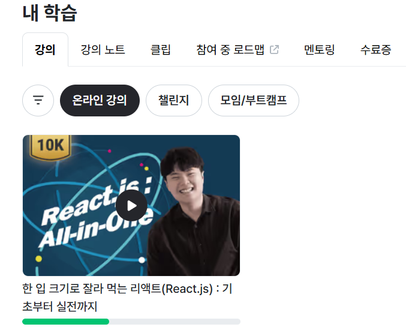
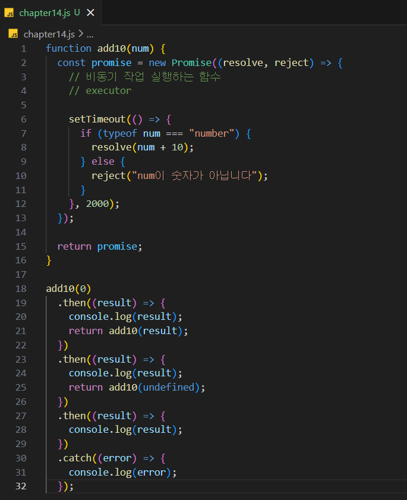
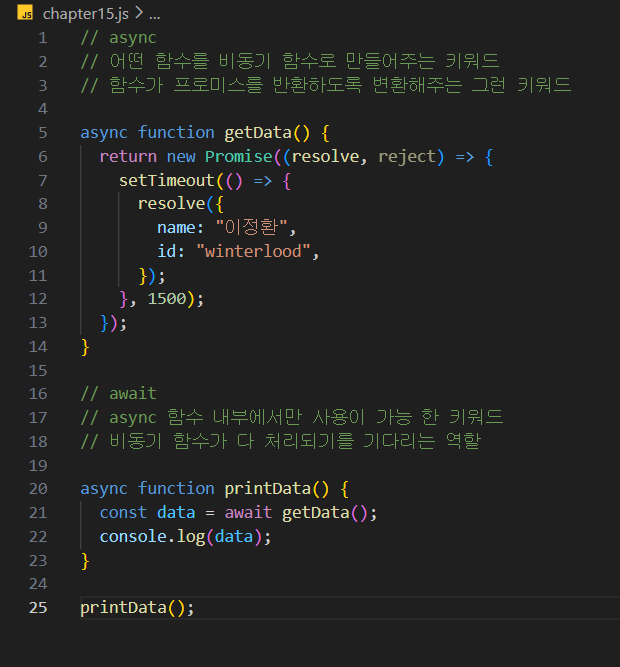
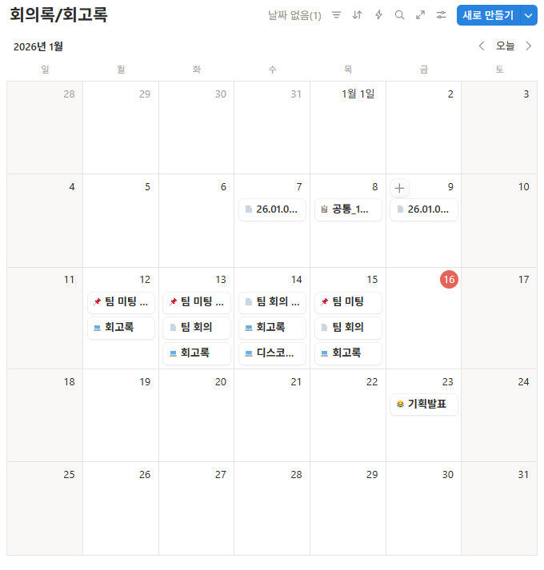
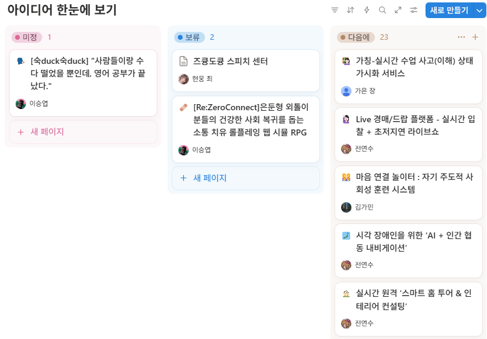

# TIL (Week 01) — 🤓Frontend(React) 학습 & 프로젝트 기획 회고🤓  
> SSAFY 2학기 팀 프로젝트 준비 기간 동안, **프론트엔드 역할**을 맡아 **React/JavaScript 비동기**를 집중 학습하고,  
> 팀원들과 **프로젝트 주제/기능을 브레인스토밍 → 수렴**했던 1주(2026.01.12-2026.01.16) 회고입니다.

---

## 1) 이번 주 한 줄 요약
**“기획은 넓게 펼치고, 구현 가능성 기준으로 좁혀 나갔다./ React로 갈아타는 첫 주!”**

---

## 2) What I did (이번 주 한 일)

### 2.1 React 학습 (프론트 역할 대비)
- Vue만 다뤄봤던 상태라, 2학기 공통프로젝트에서 React를 쓰기 위해 **기초부터 빠르게 캐치업**하는 데 초점을 뒀다.
- 강의는 “따라치기”보다 **핵심 개념(컴포넌트, state, props, 렌더링 흐름, Hook)** 위주로 정리하면서 봤다.
- 특히 “화면이 왜 다시 그려지는지”, “데이터 흐름을 어디에 두는지”를 계속 질문하면서 시청했다.

**증빙 자료 (수강 화면)**  

---

### 2.2 JavaScript 비동기(Async) 정리 — Promise / then-catch / async-await
React에서 API 호출, 실시간 이벤트 처리(WebSocket), 미디어(WebRTC) 등은 결국 **비동기 흐름 제어**가 핵심이라서  
이번 주는 JS 비동기 문법을 “확실히” 잡는 것을 목표로 했다.

#### ✅ Promise + then/catch 체이닝
- `new Promise((resolve, reject) => {})` 구조와, 성공/실패 흐름을 분리하는 이유를 정리했다.
- **then 체이닝에서 return을 어떻게 주느냐**에 따라 다음 then이 받는 값이 달라진다는 점을 체크했다.
- 일부러 `undefined` 같은 케이스를 넣어서 `reject`로 떨어지게 만들며 에러 핸들링 감각을 익혔다.

#### ✅ async / await 패턴
- `async`는 “함수를 Promise 기반으로 동작하게 해주는 키워드”라는 감각을 잡았다.
- `await`는 “이 작업 끝날 때까지 기다리고 다음 줄로 내려간다”로 이해하되,  
  **async 함수 안에서만 쓸 수 있다는 제약**을 확실히 기억했다.

---

### 2.3 팀 기획/회의 진행 & 기록
- 1주 동안 팀 미팅/회고를 반복하면서, 아이디어를 계속 확장→정리했다.
- 단순 회의가 아니라, “다음 회의에서 결정할 것 / 조사할 것”을 남기고 다시 확인하는 방식으로 진행했다.

---

## 3) 프로젝트 아이디어 브레인스토밍 → 수렴 과정

### 3.1 아이디어를 “넓게” 펼친 단계
처음에는 WebRTC/WebSocket을 살릴 수 있는 주제를 중심으로 여러 갈래로 뻗어 나갔다.  
예를 들면 아래처럼 “원격 소통” 기반 아이디어들을 다수 검토했다.

- 실시간 원격 **스마트 홈 투어 & 인테리어 컨설팅**
- 시각장애인을 위한 **AI + 인간 협동 내비게이션**
- **Live 경매/드랍** 플랫폼 (실시간 입찰 + 초저지연 라이브쇼)
- 그 외, 화상회의/공동 회의록/스터디룸/자세교정 등 다양한 후보

---

### 3.2 “구현 가능성 + 차별성” 기준으로 좁힌 단계
아이디어를 걸러낼 때는 아래 기준을 계속 반복해서 적용했다.

- **핵심 기능이 2주~5주 안에 MVP로 구현 가능한가?**
- 단순히 “있어 보이는 기능 나열”이 아니라, **사용자 흐름(UX)이 단계적으로 설계되는가?**
- 기존 서비스와 비교했을 때, **우리만의 차별 포인트를 한 줄로 말할 수 있는가?**

그 결과, 최종적으로는  
**WebRTC 기반 소그룹 영어 스몰톡 서비스** 방향이 가장 “실행 가능한데도 매력적인” 쪽으로 모였다.

> UX 흐름 예시: **대기실 → 실시간 대화 → 자동 영어 스크립트 → 발음 연습 → 리포트 제공**

(추가로, 피그마를 활용한 목업 제작도 함께 진행 중!)

---

## 4) 이번 주 회고 (Keep / Problem / Try)

### Keep ✅
- “React로 프로젝트를 해야 한다”는 부담을 피하지 않고, **기초 강의부터 꾸준히 진행**했다.
- 회의가 늘어져도 기록을 남겨서 **결정/할 일/다음 액션**이 남도록 했다.

### Problem ⚠️
- React를 처음 접하면서, 컴포넌트 구조를 머리로만 이해하고 실제로 설계해보는 시간이 부족했다.
- 아이디어 확장 단계에서 자료가 많아지면서, “무엇을 버려야 하는지” 결정이 늦어질 때가 있었다.

### Try 🔥 (다음 주 개선)
- React는 강의 시청과 별개로 **작은 UI부터라도 직접 구현하면서(컴포넌트 쪼개기)** 본격 개발에 들어가기!
- 설계(요구사항 정의서/ 목업/ API명세서/ ERD)까지 마무리하고, 바로 **개발 착수(첫 화면/공통 레이아웃부터 구현)**!

---

## 5) 첨부 자료
- **노션 개인페이지 PDF(브레인스토밍/기획 메모)**: [노션_개인페이지.pdf](./노션_개인페이지.pdf)
- 본 README에 포함된 이미지들:
  - 리액트강의.png
  - 자바스크립트코드.png / 자바스크립트코드2.png
  - 달력회의회고록.png
  - 아이디어한눈에보기.png

---

## 6) 다음 주 목표🔥
- React 기초 개념 정리 완주
- 프로젝트 MVP 범위 확정(필수/선택 기능 분리) + 목업 완성
- 개발 Start!
